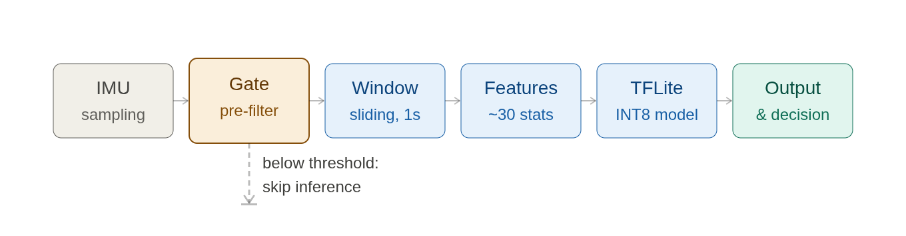
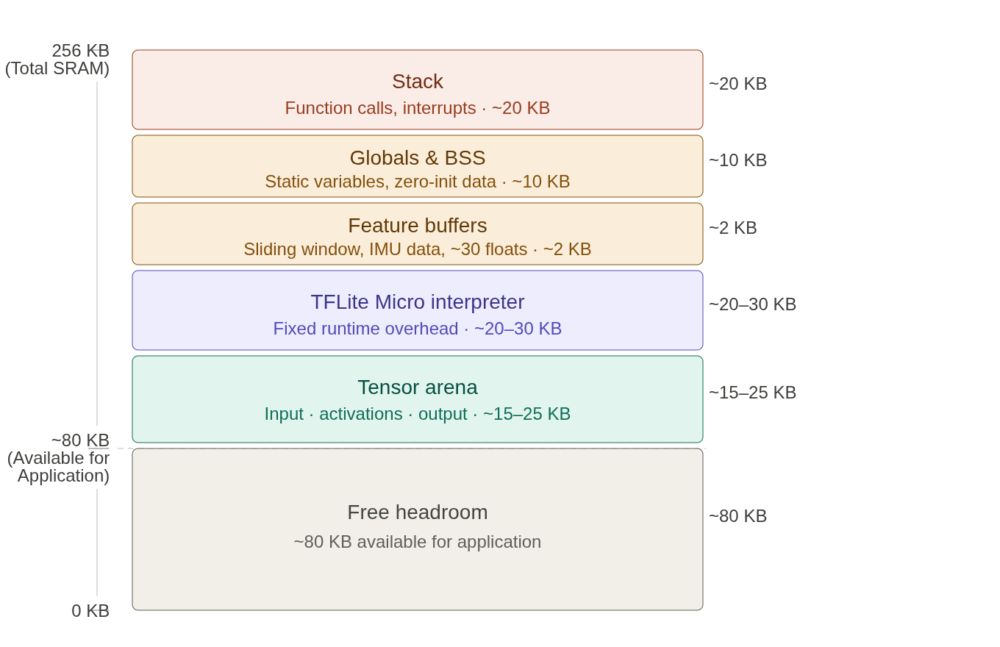

# Technical Project Description

## 1. Project Overview

This project implements an end-to-end TinyML workflow for real-time IMU-based activity and fall detection on an Arduino Nano 33 BLE Sense Rev2. The current codebase captures on-device sensor data, prepares labeled datasets, develops a lightweight TensorFlow model, quantizes it for TFLite Micro deployment, and runs inference directly on the microcontroller.

The project has also been adapted to explore a veterinary use case: continuous post-operative monitoring of animals using a compact, low-power sensor collar or harness. In this context, the same pipeline can support recovery assessment, sedation and pain monitoring, fall detection, and gait-related mobility analysis.

---

## 2. Objective and Application Context

The primary technical goal is to build a low-latency, resource-constrained AI system that can classify motion states from inertial sensor data without relying on cloud-based inference.

The project is currently framed around two related objectives:

1. Demonstrate a TinyML pipeline for activity recognition and fall detection on embedded hardware.
2. Extend that pipeline toward veterinary recovery monitoring for animals in post-operative care.

This dual focus makes the project both a technical embedded-AI prototype and a practical foundation for animal-health monitoring.

---

## 3. System Architecture

The project consists of four main technical layers, and the implementation is visualised directly below:

Figure 1. End-to-end sensing, gating, windowing, feature extraction, and inference flow.

Figure 2. SRAM distribution and runtime feasibility on the Nano 33 BLE Sense Rev2.

These diagrams are important because they make the hardware constraints explicit: the system must fit the model runtime, tensor arena, feature buffers, and stack within the available SRAM budget.

The project is organised into four main technical layers:

### 3.1 Data Acquisition Layer
- Arduino sketch captures accelerometer and gyroscope data from the onboard BMI270 IMU.
- The data stream is recorded at 50 Hz.
- The acquisition script sends the selected label to the board and waits for acknowledgment before recording begins.

### 3.1a Event-Driven Sensing Gate
- A hardware-aware pre-filter gate uses composite acceleration magnitude to suppress low-magnitude motion.
- Inference is triggered only when the signal exceeds a threshold, typically around 1.8 g, reducing unnecessary computation and limiting false positives.
- This design improves efficiency and energy usage while preserving responsiveness to high-magnitude motion events.

### 3.2 Dataset Preparation Layer
- The Python tool `data_capture.py` reads serial data from the Arduino.
- It writes labeled CSV files to `device_native_dataset/`.
- The project uses multiple data sources for development and validation, including the SisFall original dataset from Kaggle (https://www.kaggle.com/datasets/nvnikhil0001/sis-fall-original-dataset), the UCI HAR dataset from Kaggle (https://www.kaggle.com/datasets/drsaeedmohsen/ucihar-dataset), and the device-native IMU recordings collected in this repository.
- The current dataset schema contains:
  - `timestamp_ms`
  - `label`
  - `ax`, `ay`, `az`
  - `gx`, `gy`, `gz`

### 3.3 Model Development Layer
- Jupyter notebooks in the project are used for training, feature engineering, and quantisation experiments.
- The current prototype targets a binary classification problem:
  - `STATIONARY`
  - `WALKING`

### 3.4 Embedded Inference Layer
- The Arduino inference sketch loads a quantised TFLite Micro model, processes a sliding IMU window, extracts features, and performs inference on-device.
- The result is printed over serial and visualized using onboard LEDs.

---

## 4. Hardware and Software Stack

### 4.1 Hardware
- Arduino Nano 33 BLE Sense Rev2
- nRF52840-based microcontroller
- BMI270 IMU sensor
- Onboard RGB LED for inference feedback

### 4.2 Software
- Python 3.9+ / 3.11 tested in the current environment
- TensorFlow and TFLite for model development and quantisation
- Arduino IDE / Arduino CLI for firmware deployment
- Python serial communication for dataset capture

### 4.3 Core Libraries and Tooling
- `pyserial` for serial data collection
- TensorFlow Lite Micro for on-device inference
- CSV-based logging for offline dataset building

---

## 5. Data Collection Workflow

The current data collection process is implemented in `data_capture.py` and follows this sequence:

1. Connect the Arduino to the host computer via USB.
2. Start the serial capture script.
3. Select a target label from the predefined class list.
4. Set a recording duration.
5. Send the selected label to the Arduino and wait for confirmation.
6. Flush warm-up samples to avoid unlabeled rows.
7. Save IMU samples to a timestamped CSV file in `device_native_dataset/`.

This workflow is important because it reduces label contamination and ensures that recorded samples are aligned with the intended behavior class.

---

## 6. Signal Processing and Feature Engineering

The Arduino inference sketch uses a sliding window approach with the following configuration:

- Window size: 50 samples
- Sampling rate: 50 Hz
- Sampling period: 20 ms
- Sensor axes: 6 total (3 accelerometer + 3 gyroscope)
- Feature vector size: 28 values
- Window length: approximately 1 second of data for one inference cycle

This makes the system near-real-time rather than instantaneous, with a bounded latency that is suitable for demonstration and embedded monitoring. The pre-filter gate reduces the number of model invocations by rejecting low-amplitude inputs before the windowing and feature-extraction stages begin.

The extracted features include:

- Mean and standard deviation for each of the 6 sensor axes
- Minimum and maximum values for each axis
- Mean absolute acceleration over the window
- Mean absolute gyro over the window
- Mean and standard deviation of acceleration magnitude

This feature design is intentionally lightweight and suitable for microcontroller deployment.

---

## 7. Model Design and Quantisation

The inference path uses a quantised TFLite Micro model to reduce memory footprint and improve suitability for embedded hardware.

The draft design notes describe a lightweight fully connected neural network with:
- an input layer of roughly 30 engineered features,
- one hidden layer with 32 ReLU neurons,
- and an output softmax layer over four classes.

In the current repository, the deployed prototype is still binary (`STATIONARY` vs `WALKING`), but the design notes indicate a future expansion path toward richer class definitions. The sketch includes quantisation metadata such as:

- `INPUT_SCALE = 0.06866828f`
- `INPUT_ZERO_POINT = -71`
- `OUTPUT_SCALE = 0.00390625f`
- `OUTPUT_ZERO_POINT = -128`

These values are used to convert floating-point features into the int8 format expected by the quantised model. The inference output is then converted back to probability-like values for classification.

Post-training INT8 quantisation is expected to provide roughly fourfold compression, improving both storage efficiency and inference speed. The current model performs a two-class prediction task, which is adequate for the prototype phase, but the longer-term design target is broader and more clinically meaningful classification for veterinary recovery monitoring.

---

## 8. Embedded Inference Pipeline

The on-device inference loop follows this sequence:

1. Read accelerometer and gyroscope samples from the IMU.
2. Store samples in a rolling 50-sample buffer.
3. Extract the 28-feature vector.
4. Scale and quantize the feature vector.
5. Run TensorFlow Lite Micro inference.
6. Convert outputs to class probabilities.
7. Print the prediction and confidence over serial.
8. Use the onboard LED to indicate the predicted state.

The implementation is designed for real-time operation with low memory overhead, which is essential for battery-powered edge deployment.

---

## 9. Current Technical Status

This project is currently in a research-prototype stage. The main strengths are:

- an event-driven sensing approach that avoids always-on inference,
- a working acquisition pipeline from Arduino to CSV,
- a clear embedded inference path with quantised TFLite Micro,
- a lightweight feature-extraction implementation suitable for microcontrollers,
- and a realistic route toward low-power, on-device activity recognition.

The main challenges are:

- the current classifier appears to be limited to a binary `STATIONARY` vs `WALKING` setup
- the model currently shows signs of class imbalance or underfitting in the prototype phase
- the project still needs broader animal-specific datasets and validation for veterinary monitoring scenarios
- simulated fall behavior is not identical to real clinical falls, so performance claims must be scoped carefully
- SRAM and tensor-arena sizing are critical deployment constraints on the Nano 33 BLE Sense Rev2

---

## 10. Veterinary Relevance and Future Direction

The current project has strong potential for veterinary use because the same IMU-based sensing pipeline can be used to monitor animals in recovery.

Possible veterinary applications include:

- continuous post-operative monitoring
- sedation and pain trend analysis
- detection of unusual agitation, scratching, or head shaking
- fall and recumbency alerts for high-risk recovery cases
- mobility and gait trend analysis for orthopedic rehabilitation

This makes the project not only an embedded-AI demonstration but also a practical foundation for low-stress, long-duration monitoring in animal healthcare settings.

---

## 11. Memory and Deployment Constraints

The Arduino Nano 33 BLE Sense Rev2 provides 256 KB of SRAM, but only part of that is available for runtime allocation after the system, BLE stack, and other libraries reserve memory. This creates a hard constraint on the tensor arena, feature buffer, interpreter objects, and stack usage. The SRAM layout diagram in [SRAM Layout](images/SRAM_layout.png) illustrates this partitioning and highlights why the model and runtime must be kept intentionally small.

The design therefore depends on:
- careful tensor-arena profiling,
- explicit memory budgeting,
- and avoidance of dynamic memory allocation during inference.

These constraints shape the model architecture, the feature set, and the quantisation approach. In this project, the memory footprint is treated as a first-class design variable rather than an afterthought.

## 12. Known Limitations and Mitigation Strategies

The following limitations are explicitly acknowledged in the current development notes:

- Simulated falls do not fully capture real-world fall trajectories or impact magnitudes.
- The current dataset is limited in diversity and may not yet represent the full range of animal motion.
- Confidence scores can be inflated if evaluation is not separated by sessions.
- Debugging on microcontroller hardware is more constrained than in a desktop environment.

Mitigation strategies include held-out session evaluation, conservative performance claims, and using device-native data whenever possible.

## 13. Recommended Next Steps

To advance the project from prototype to robust deployment, the next milestones should be:

1. Expand the dataset to include more realistic animal motion and recovery-related behaviours.
2. Improve model robustness to reduce one-class or misclassification behaviour.
3. Add more activity classes if the application expands beyond simple motion recognition.
4. Validate performance on real hardware under continuous operation.
5. Develop a veterinary-specific evaluation strategy using recovery, gait, and distress indicators.

---

## 14. Summary

This repository demonstrates an effective TinyML workflow for IMU-based activity and fall detection on an Arduino-class device. Its main technical value lies in the combination of:

- real-time sensor acquisition,
- dataset generation from embedded hardware,
- quantised model deployment,
- and low-power on-device inference.

With the added veterinary application focus, the project becomes a credible starting point for intelligent, non-invasive monitoring in animal recovery and rehabilitation contexts.
